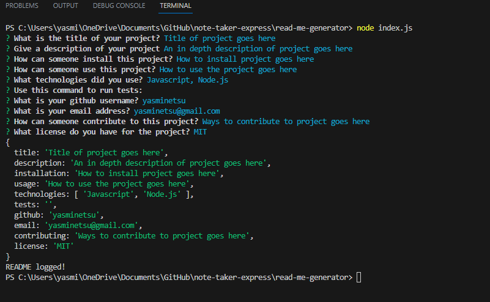
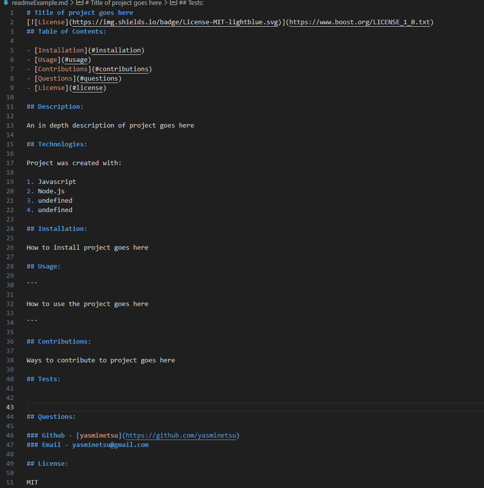
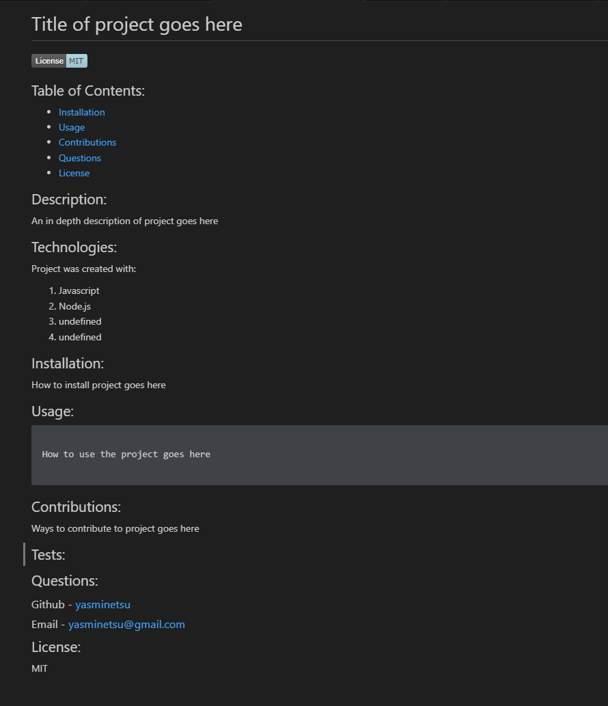

# Read-Me-Generator

A Node.js application that presents the user with different prompts for information that would go in a README file, and then generates a custom README file with all the information provided.   

# Description

As a developer, it is important to be efficient with time. A thorough README file is also really important for helping other developers and onlookers to understand a given project and how it works. This app was created to help developers have a quick and easy way to create a README file that is up to industry standard, but takes out all the time having to write in the markdown themselves. In short, it is a fast way to get a solid README file written without having to put in much of the work.

## Walkthrough Video

  <a href="https://www.youtube.com/watch?v=9KYg-qhfkWE/">


## Technologies Used

Project was created with:
* Express
* Javsscript
* Node.js

## Installation

To run this project, pull it from Github to your local machine using your terminal.
   
#### Steps: 

1. Open Github
2. Navigate to the 'yasminetsu/read-me-generator" repository. 
3. Click the green button on the page that says "code."
4. Copy the link under SSH. 
5. Open your terminal and type the following keys.

```
$ cd <any folder you want this repository to go to>
$ git clone <paste the copied link>
```
#





